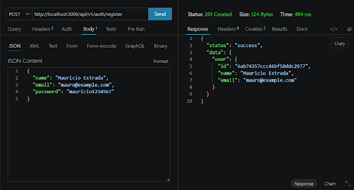
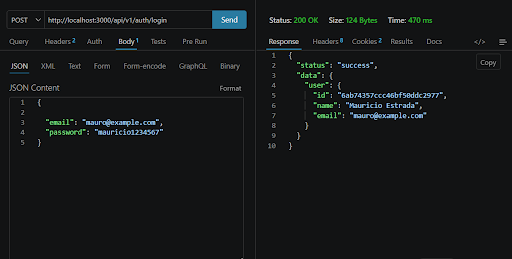
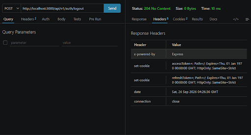
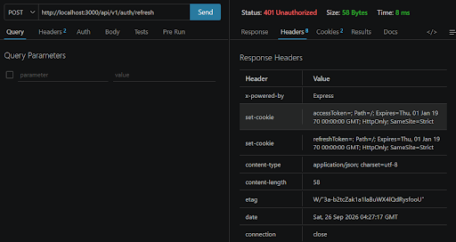
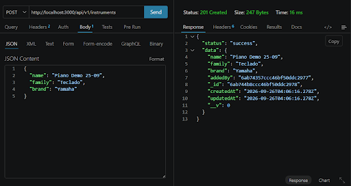
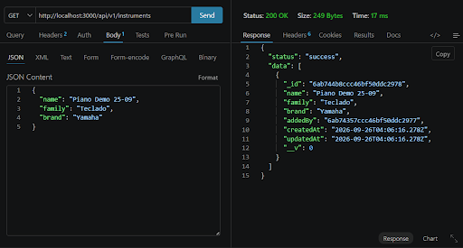
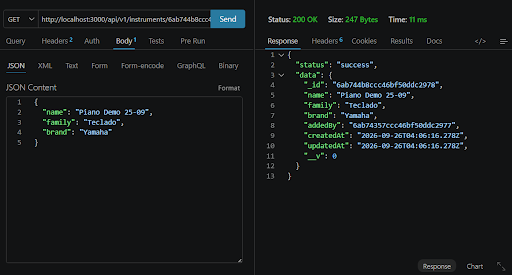
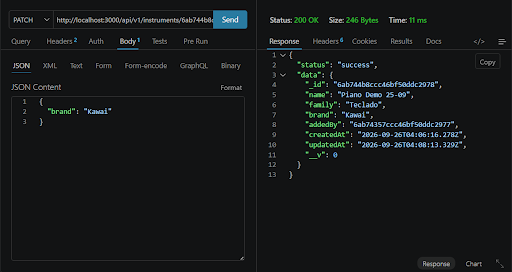
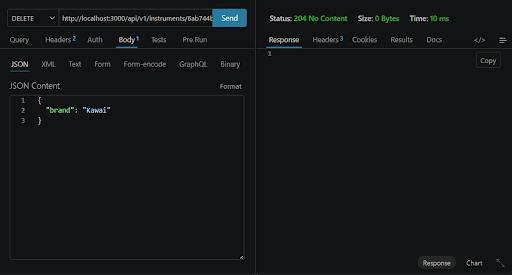

# API REST - Escuela de Música

API backend para administrar estudiantes, instrumentos, lecciones y profesores de una escuela de música. Está construida con Node.js, Express 5, TypeScript, MongoDB/Mongoose y Zod. La autenticación usa JWT en cookies `HttpOnly`; las contraseñas se almacenan con bcrypt.

## Requisitos

- Node.js
- pnpm
- MongoDB local o una URI de MongoDB Atlas

## Configuración

Crea un archivo `.env` en la raíz del proyecto, junto a `package.json`:

```env
PORT=3000
MONGO_URI=mongodb://localhost:27017/music-school
JWT_ACCESS_SECRET=secreto_aleatorio_de_al_menos_32_caracteres
JWT_REFRESH_SECRET=otro_secreto_aleatorio_distinto_de_32_caracteres
NODE_ENV=development
```

Usa dos secretos aleatorios distintos. No los publiques ni subas `.env` al repositorio. Puedes generar cada valor con Node.js:

```powershell
node -e "console.log(require('node:crypto').randomBytes(32).toString('hex'))"
```

`dotenv/config` carga `.env` desde la raíz del proyecto, no desde `src/.env`.

### MongoDB con Docker

Para crear y arrancar una base local persistente, expuesta solo en localhost:

```powershell
docker run --name music-school-mongo -p 127.0.0.1:27017:27017 -v music-school-data:/data/db -d mongo:8
```

En ejecuciones posteriores:

```powershell
docker start music-school-mongo
```

Si usas Atlas, sustituye `MONGO_URI` por la URI de conexión de tu clúster.

## Instalación y ejecución

```powershell
pnpm install
pnpm dev
```

La API estará en `http://localhost:3000`. Comprueba el estado del servidor en `GET /health`.

Para compilar y ejecutar la versión de producción:

```powershell
pnpm build
pnpm start
```

Scripts adicionales:

- `pnpm seed`: carga instrumentos y profesores de ejemplo. Requiere que ya exista al menos un usuario registrado; elimina los documentos actuales de esas dos colecciones antes de insertar los ejemplos.

## Autenticación

| Método | Ruta | Descripción | Acceso |
| --- | --- | --- | --- |
| `POST` | `/api/v1/auth/register` | Registra un usuario y crea una sesión | Público |
| `POST` | `/api/v1/auth/login` | Inicia sesión | Público |
| `POST` | `/api/v1/auth/refresh` | Rota el par de tokens | Cookie refresh |
| `POST` | `/api/v1/auth/logout` | Revoca el refresh token y limpia cookies | Cookie refresh |
| `GET` | `/api/v1/auth/me` | Devuelve el usuario autenticado | Cookie access |

Registro de ejemplo:

```json
{
  "name": "Usuario de Prueba",
  "email": "usuario@example.com",
  "password": "UnaClaveSegura123!"
}
```

El registro exige nombre de al menos 2 caracteres, correo válido y contraseña de al menos 10 caracteres. El servidor envía `accessToken` y `refreshToken` en cookies `HttpOnly`; no devuelve los tokens en el cuerpo JSON. Usa Postman o Thunder Client con almacenamiento de cookies habilitado para las solicitudes protegidas. En producción las cookies se marcan `Secure` y utilizan `SameSite=Strict`.

## Recursos de la escuela

Todas las rutas siguientes requieren la cookie `accessToken` obtenida al registrarse o iniciar sesión. Las actualizaciones usan `PATCH` y aceptan los campos modificables del recurso.

| Recurso | Colección | Campos principales |
| --- | --- | --- |
| Estudiantes | `/api/v1/students` | `name`, `email`, `age`, `level`, `instruments` |
| Instrumentos | `/api/v1/instruments` | `name`, `family`, `brand`, `description` |
| Lecciones | `/api/v1/lessons` | `title`, `student`, `teacher`, `instrument`, `scheduledAt`, `durationMinutes`, `notes` |
| Profesores | `/api/v1/teachers` | `name`, `email`, `specialty`, `instruments`, `availability` |

Para cada colección `BASE`, están disponibles estas cinco operaciones:

| Método | Ruta | Respuesta esperada |
| --- | --- | --- |
| `GET` | `BASE` | Lista los registros |
| `GET` | `BASE/:id` | Obtiene un registro |
| `POST` | `BASE` | Crea un registro (`201`) |
| `PATCH` | `BASE/:id` | Actualiza un registro |
| `DELETE` | `BASE/:id` | Elimina un registro (`204`) |

Ejemplo: `POST /api/v1/students`

```json
{
  "name": "Estudiante de Prueba",
  "email": "estudiante@example.com",
  "age": 12,
  "level": "beginner",
  "instruments": []
}
```

Niveles válidos: `beginner`, `intermediate` y `advanced`. Los valores de `instruments` deben ser ObjectId válidos.

Ejemplo: `POST /api/v1/lessons`

```json
{
  "title": "Primera clase de piano",
  "student": "ID_DE_ESTUDIANTE",
  "teacher": "ID_DE_PROFESOR",
  "instrument": "ID_DE_INSTRUMENTO",
  "scheduledAt": "2026-10-01T16:00:00.000Z",
  "durationMinutes": 60,
  "notes": "Repasar escalas"
}
```

Los tres IDs de referencia deben corresponder a registros existentes. Todos los recursos guardan en `addedBy` el usuario autenticado que los creó.

## Respuestas y errores

- `200`: consulta o actualización correcta.
- `201`: registro creado.
- `204`: registro eliminado, sin cuerpo de respuesta.
- `400`: datos inválidos o ObjectId mal formado.
- `401`: sesión ausente, inválida, expirada o refresh token revocado.
- `404`: recurso o referencia no encontrada.
- `409`: valor único duplicado, como un correo o nombre de instrumento.

Los errores se convierten a respuestas JSON mediante el middleware centralizado.

## Evidencia de pruebas en Thunder Client

### Autenticación

**Registro exitoso**



**Login con cookies**



**Acceso sin token: captura 1**

.png>)

**Acceso sin token: captura 2**

.png>)

**Logout**



**Refresh posterior al logout**



### CRUD de instrumentos

**Crear instrumento**



**Listar instrumentos**



**Obtener instrumento por ID**



**Actualizar instrumento**



**Eliminar instrumento**


